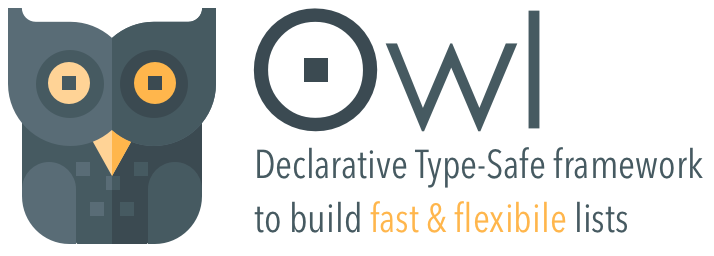
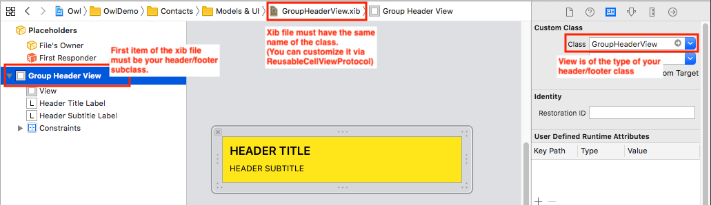
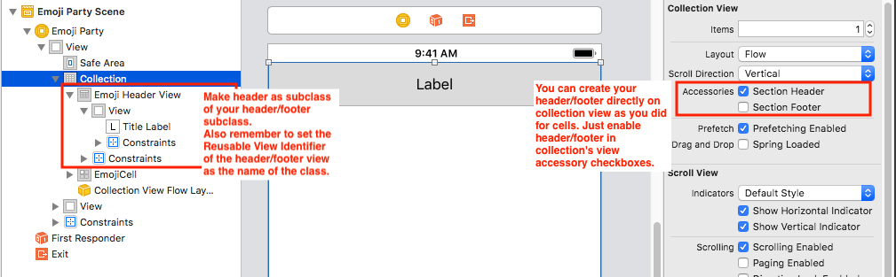

<p align="left" >

</p>

Owl offers a data-driven declarative approach for building fast & flexible list in iOS.

It supports both `UICollectionView` & `UITableView`; *`UIStackView` is on the way!*

|  	| Features Highlights 	|
|---	|---------------------------------------------------------------------------------	|
| 🕺 	| No more delegates & datasource. Just a fully type-safe declarative content approach 	|
| 🧩 	| Better architecture to reuse components e decuple data from UI 	|
| 🌈 	| Animate content changes automatically, no `reloadData`/`performBatchUpdates` 	|
| 🚀 	| Blazing fast diff algorithm based upon [DifferenceKit](https://github.com/ra1028/DifferenceKit) 	|
| 🧬 	| It uses standard UIKit components at its core. No magic! 	|
| 💎 	| (COMING SOON) Support for scrollable declarative/fully customizable stack view 	|
| 🐦 	| Fully made in Swift from Swift ❥ lovers 	|

Owl was created and maintaned by [Daniele Margutti](https://github.com/malcommac) - My home site [www.danielemargutti.com](https://www.danielemargutti.com).

[](http://cocoadocs.org/docsets/OwlKit) 
[](http://cocoadocs.org/docsets/OwlKit) 
[](http://cocoadocs.org/docsets/OwlKit)
[](https://travis-ci.org/malcommac/OwlKit) 
[](https://github.com/Carthage/Carthage) 


## Requirements

- Xcode 9.0+
- iOS 10.0+
- Swift 5+

## Installation

The preferred installation method is with CocoaPods. Add the following to your Podfile:

```ruby
pod 'OwlKit', '~> 1.0
```

## What you will get

This is how to achieve a fully functional Contacts list with Owl. It's just a silly example but you can create complex layout with heterogeneous models easily!

```swift
director = TableDirector(table: table)

// An adapter encapsulate the logic to render a model (Contact) with a specific ui (ContactCell).
let contactAdapter = TableCellAdapter<Contact,ContactCell> { dr in

	// Each adapter exposes all the standard methods of a list, events
	// and properties. ctx (context) received from event is a type-safe
	// object both for model and cell!
	dr.events.dequeue = { ctx in
		// element is type-safe, it's the Contact instance!
		// cell is type-safe, it's the ContactCell instance
		ctx.cell?.item = ctx.element
	}
	dr.events.didSelect = { ctx in
		let vc = ContactDetailVC(people: ctx.element)
		navigationController.pushViewController(vc, animated: true)
	}
	dr.events.shouldHighlight = { ctx in
		return ctx.element.isBlacklisted == false
	}
}
// Since now our table can show Contact istances using ContactCell
// All events are received only in its adapter.
director?.registerCellAdapter(contactAdapter) 

/// Manage your content in a declarative way!
let friendsSection = TableSection(elements: [john,mark,anita])
director?.add(section: friendsSection)
director?.reload()
```

## License

- Owl is released under the Apache 2.0 License.
- DifferenceKit is released under the Apache 2.0 License.
- Owl Icon is made by <a href="https://www.freepik.com/?__hstc=57440181.2ec9032a4253af7a6c076e26b17c0e4f.1556611478423.1556611478423.1556635522124.2&__hssc=57440181.7.1556635522124&__hsfp=2502665684" title="Freepik">Freepik</a> from <a href="https://www.flaticon.com/" 			    title="Flaticon">www.flaticon.com</a> is licensed by <a href="http://creativecommons.org/licenses/by/3.0/" 			    title="Creative Commons BY 3.0" target="_blank">CC 3.0 BY</a></div>
 
[Full License File](./LICENSE).

<a name="doc"/>

## Documentation

- 1 - [Introduction: Director & Adapters](#1)
- 2 - [Getting Started](#2)
- 3 - [How-To](#3)
	- [3.1 - Create Model](#3.1)
	- [3.2 - Create UI (cells)](#3.2)
	- [3.3 - Manage Self-Sized Cells](#3.3)
	- [3.4 - Loading Cells from Storyboard, Xib or class](#3.4)
	- [3.5 - Custom Section's Header/Footer (String/View based)](#3.5)
	- [3.6 - Reload data with automatic animations](#3.6)
	- [3.7 - Working with Headers & Footers](#3.7)
- 4 - [APIs Doc: Manage `UITableView`](./Documentation/Manage_Tables.md)
- 5 - [APIs Doc: Manage `UICollectionView`](./Documentation/Manage_Collections.md)
- 6 - [Listen for `UIScrollViewDelegate` events](./Documentation/Manage_UIScrollViewDelegate_Events.md)

<a name="1"/>

### Introduction: Director & Adapters

All the Owl's SDK is based upon two concepts: the **director** and the **adapter**.

#### Director

The **director** is the class which manage the content of a list, keep in sync data with UI and offers all the methods and properties to manage it. When you need to add, move or remove a section or a cell, change the header or a footer you find all the methods and properties in this class.
A director instance can be associated with only one list (table or collection); once a director is assigned to a list it become the datasource and delegate of the object.

The following directors are available:

- `TableDirector` used to manage `UITableView` instances
- `CollectionDirector` and `FlowCollectionDirector` used to manage `UICollectionView` with custom or `UICollectionViewFlowLayout` layout.

#### Adapters

Once you have created a new director for a list it's time to declare what kind of models your list can accept. Each model is assigned to one UI element (`UITableViewCell` subclass for tables, `UICollectionViewCell` subclass for collections).

The scope of the adapter is to declare a pair of Model & UI a director can manage. 

The entire framework is based to this concept: a model can be rendered by a single UI elements and its up to Owl to pick the right UI for a particular model instance.

An adapter is also the centrail point to receive events where a particular instance of a model is involved in. For example: when an user tap on a row for a model instance of type A, you will receive the event (along with the relevant info: index path, involved model instance etc.) inside the adapter which manage that model.

You will register as much adapters as models you have.

<a name="2"/>

### Getting Started

The following code shows how to create a director to manage an `UITableView` (a much similar approach is used for `UICollectionView`).

```swift
public class MyController: UIViewController {
	@IBOutlet public var table: UITableView!
	
	private var director: TableDirector?
	
	func viewDidLoad() {
		super.viewDidLoad()
		director = TableDirector(table: table)
// ...
```

It's now time to declare what kind of content should manage our director. For shake of simplicity we'll declare just an adapter but you can declare how much adapters you need (you can also create your own director with adapters inside and reuse them as you need. This is a neat approach to reuse and decupling data).

```swift
func viewDidLoad() {
	// ...
	let contactAdpt = TableCellAdapter<Contact, ContactCell>()
	
	// You can attach events for adapter configuration.
	// The following example show how to set the row height and dequeue
	
	contactAdpt.events.rowHeight = { ctx in
		return 60.0 // explicit row height
	}
	
	contactAdpt.events.dequeue = { ctx in
		// this is the suggested behaviour; your cell should expose a
		// property of the type of the model it can be render and you will
		// assign it on dequeue. It's type safe too!!
		ctx.cell?.contact = ctx.element
	}
	director?.registerCellAdapter(contactAdpt)
```

This is minimum setup to render objects of type `Contact` using cell of type `ContactCell` using our director.
You can configure and attach tons of other properties and events (using the adapter's `.events` property); you will found a more detailed description of each property below but all `UITableView`/`UICollectionView`'s events and properties are supported.

Now it's time to add some content to our table.
As we said Owl uses a declarative approach to content: this mean you set the content of a list by using imperative functions like `add`,`remove`,`move` both for sections and elements.

```swift
// You can add/remove/move elements at anytime in a declarative way
let contacts = [
	Contact(first: "John", last: "Doe"),
	Contact(first: "Adam", last: "Best"),
	...
]
// ...
director?.add(elements: contacts)
director?.remove(section: 1)
```

There are a plenty list of methods to manage both sections and elements into section:

```swift
director?.firstSection?.removeAt(2) // remove an element
director?.remove(section: 2) // remove section
director?.section("mySection").move(swappingAt: 0, with:1) // swap elements
director?.add(elements: [...], at: 5) // add new elements
// and more...
```
Once you have changed your data models you can call `reload()` function to sync it with UI.

The following code create (automatically) a new `TableSection` with the `contacts` elements inside. If you need you can create a new section manually:

```swift
// Create a new section explicitly. Each section has an unique id you can assign
// explicitly or leave Owl create an UUID for you. It's used for diff features.
let newSection = TableSection(id: "mySectionId", elements: contacts, header: "\(contacts) Contacts", footer: nil)
director?.add(section: newSection)
```

In order to sync the UI just call the `director?.reload()`, et voilà!
Just few lines of code to create a fully functional list!

At anytime you are able to add new sections, move or replace items just by using the methods inside the `TableSection`/`CollectionSection` or `TableDirector`/`CollectionDirector` instances then calling `reload()` to refresh the content.

Refresh is made without animation, but Owl is also able to refresh the content of your data by picking the best animation based on a blazing fast diff algorithm which compare the data before/after your changes. More details in the next chapter. 

The following code demostrate how to add swipe to delete functionality to an adapter:

```swift
catalogAdapter.events.canEditRow = { ctx in
  return true
}
        
catalogAdapter.events.deleteConfirmTitle = { ctx in
  return "Delete"
}
        
catalogAdapter.events.commitEdit = { [weak self] ctx, style in
  guard let indexPath = ctx.indexPath else { return }
  
  // By using the session to reload you will also receive events like didEndEditingCell
  self?.tableDirector?.reload(afterUpdate: { dir in
    dir.sections[indexPath.section].remove(at: indexPath.row)
    return .none
  }, completion: nil)
}
```

<a name="3"/>

### How-To

<a name="3.1"/>

#### Create Model

Models can be struct or classes; the only requirement is the conformance to `ElementRepresentable` protocol.
This protocol is used by the diff algorithm in order to evaluate the difference between changes applied to models and pick the best animation to show it.

This means you don't need to make any `performBatches` update neither to call `reloadRows/removeRows/addRows` methods manually... all these boring and crash-proned stuff are made automatically by Owl.

The following example show our `Contact` model declaration:

```swift
public class Contact: ElementRepresentable {
    let firstName: String
    let lastName: String

	public var differenceIdentifier: String {
		return "\(self.firstName)_\(self.lastName)"
	}

	public func isContentEqual(to other: Differentiable) -> Bool {
		guard let other = other as? Contact else { return false }
		return other == self
	}

	init(first: String, last: String) {
		self.firstName = first
		self.lastName = last
	}
}
```

##### Protocol Conformance

Protocol conformance is made by adding:

- `differenceIdentifier` property: An model needs to be uniquely identified to tell if there have been any insertions or deletions (it's the perfect place for a `uuid` property)
- `isContentEqual(to:)` function: is used to check if any properties have changed, this is for replacement changes. If your model data change between reloads Owl updates the cell's UI accordingly.

<a name="3.2"/>

#### Create UI (Cells)

The second step is to create an UI representation of your model. Typically is a subclass of `UITableViewCell` or `UICollectionViewCell`.

##### Reuse Identifier

Cells must have as `reuseIdentifier` value the same name of the class itself (so `ContactCell` has also `ContactCell` as identifier; you can also configure it if you need but it's a good practice).

<a name="3.3"/>

##### Loading Cells from Storyboard, Xib or class

By default cells are loaded from managed table/collection instance storyboard but sometimes you may also need to load them from external files like xib.
In this case you must override the static `reusableViewSource` property of your cell subclass and provide the best loading source between values of `ReusableViewSource`:

- `fromStoryboard`: load from storyboard (the default value, use it when your cell is defined as prototype inside table's instance).
- `fromXib(name: String?, bundle: Bundle?)`: load from a specific xib file in a bundle (if `name` is nil it uses the same filename of the cell class, ie `ContactCell.xib`; if `bundle` is `nil` it uses the same bundle of your cell class.
- `fromClass`: loading from class.

The following example load a cell from an external xib file named `MyContactCell.xib`:

```swift
public class ContactCell: UITableViewCell {
    // ...
    
    public static var reusableViewSource: ReusableViewSource {
        return .fromXib(name: "MyContactCell", bundle: nil)
    }
}
```

##### Best Practices

You don't need to conform any special protocol but, in order to keep your code clean, our suggestion is to create a public property which accepts the model instance and set it on adapter's `dequeue` event.

```swift
public class ContactCell: UITableViewCell {

	// Your outlets
    @IBOutlet public var ...

	// Define a property you set on adapter's dequeue event
	public var contact: Contact? {
		didSet {
           // setup your UI according with instance data
		}
	}
}
```

In your adapter:

```swift
contactAdpt.events.dequeue = { ctx in
	ctx.cell?.contact = ctx.element
}
```

`ctx` is an object which includes all the necessary informations of an event, including type-safe instance of the model.

<a name="3.4"/>

#### Manage Self-Sized Cells

Self-sized cells are easy to be configured, both for tables and collection views.

Owl support easy cell sizing using autolayout. You can set the size of the cell by adapter or collection/table based. For autolayout driven cell sizing set the `rowHeight` (for `TableDirector`) or `itemSize` (for `CollectionDirector`/`FlowCollectionDirector`) to the autoLayout value, then provide an estimated value.

Accepted values are:

- `default`: you must provide the height (table) or size (collection) of the cell
- `auto(estimated: CGFloat)`: uses autolayout to evaluate the height of the cell; for Collection Views you can also provide your own calculation by overriding `preferredLayoutAttributesFitting()` function in cell instance.
- `explicit(CGFloat)`: provide a fixed height for all cell types (faster if you plan to have all cell sized same)

<a name="3.5"/>

#### Custom Section's Header/Footer

Sections (both `TableSection` and `CollectionSection`) can be configured to have both simple (`String`) or complex (custom views) header/footer.
Custom Header/Footer are configured in the same way you have made for cells, by using the concept of adapter.

To create a **simple string-based header/footer** just pass its value into the init of section object:

```swift
let newTableSection = TableSection(id: "sectionId", elements: contacts, header: "\(contacts.count) Contacts", footer: nil)
```

The following code create a section with a string header which contains the number of contacts inside that section.

To create a **view-based header/footer** you must register an adapter using:

- `TableHeaderFooterAdapter<View>` class for table (where `View` is a subclass of `UITableViewHeaderFooterView `)
- `CollectionHeaderFooterAdapter<View>` for collections (where `View` is a subclass of `UICollectionReusableView`)

In this case adapter keeps only the reference of the header/footer view class type (no explicit models are involved).

The following example create a view-based header for a collection and configure it with some custom data:

```swift
// In our case our custom view is a class EmojiHeaderView subclass of UICollectionReusableView 
let emojiHeader = CollectionHeaderFooterAdapter<EmojiHeaderView> { ctx in
	ctx.events.dequeue = { ctx in // register for view dequeue events to setup some data
		ctx.view?.titleLabel.text = ctx.section?.identifier ?? "-"
	}
}
// Register adapter for header/footer
director?.registerHeaderFooterAdapter(headerAdapter)
```

Once you have registered your header/footer you can assign it to the init of any section:

```swift
let newSection = CollectionSection(id: "Section \(idx)" ,elements: elements, header: emojiHeader, footer: nil)
```

in the `ctx` parameter you will receive the section which generates the event.

<a name="3.6"/>

#### Reload data with automatic animations

Owl supports automatic animated reload of the data between changes.
With this feature you don't need to think about calling (even *in the correct order*) `reloadRows/deleteRows/removeRows` methods when changing your data source: just perform changes to your model in a callback and, at the end, Owl will generate the corrrect sequence of the animations.

This because in `performBatchUpdates` of `UITableView` and `UICollectionView`, there are combinations of operations that cause crash when applied simultaneously.
To solve this problem, [DifferenceKit](https://github.com/ra1028/DifferenceKit/blob/master/README.md) takes an approach of split the set of differences at the minimal stages that can be perform batch-updates with no crashes.

The following example:

```swift
director?.reload(afterUpdate: { dir in
   dir.firstSection()!.elements.shuffled() // shuffle some items
   dir.firstSection()!.remove(at: 4) // remove item at index 4
   // ... do any other stuff with sections or elements in section
}, completion: nil)
```
At the end of the call Owl will compare data models before/after and produce a changeset of animations to execute,

Diffing algorithm is based upon the DifferenceKit framework, an O(n) difference algorithm optimized for performance in Swift. It supports all operations for animated UI batch-updates including section reloads.

Compared to IGListKit it allows:

**Supported collection**

|             |Linear|Sectioned|Duplicate Element/Section|
|:------------|:----:|:-------:|:-----------------------:|
|Owl|✅    |✅       |✅                        |
|RxDataSources|❌    |✅       |❌                        |
|IGListKit    |✅    |❌       |✅                        |

`Linear` means 1-dimensional collection.  
`Sectioned` means 2-dimensional collection.  

**Supported element differences**

|             |Delete|Insert|Move|Reload  |Move across sections|
|:------------|:----:|:----:|:--:|:------:|:------------------:|
| Owl |✅    |✅     |✅  |✅      |✅                   |
|RxDataSources|✅    |✅     |✅  |✅      |✅                   |
|IGListKit    |✅    |✅     |✅  |✅      |❌                   |

**Supported section differences**

|             |Delete|Insert|Move|Reload|
|:------------|:----:|:----:|:--:|:----:|
|Owl|✅    |✅     |✅  |✅    |
|RxDataSources|✅    |✅     |✅  |❌    |
|IGListKit    |❌    |❌     |❌  |❌    |

Moreover it way faster than [IGListKit](https://github.com/Instagram/IGListKit) and [RxDataSources](https://github.com/RxSwiftCommunity/RxDataSources) counterparts!

<a name="3.7"/>

#### 3.7 - Working with Headers & Footers

Headers and Footers in Owl are managed in the same way already used for Cells, using Adapter; however due to its nature (instead of cells they are not strictly correlated to a specific model class) you will create an adapter which links just the view used to render it (subclass of `UITableViewHeaderFooterView` for `UITableView` and subclass of `UICollectionReusableView` for `UICollectionView`).

**A. Creating Header/Footer for UITableView**

Using header/footer in your `UITableView` via storyboard is not easy; the most affordable way is to create a xib file with the same name of your `UITableViewHeaderFooterView` subclass.

Suppose you want to make an header/footer class called `GroupHeaderView` for your Contacts table. You will need to create:

`GroupHeaderView.xib` file which contains the UI of the class (you can still customize how the view is loaded by overriding the `ReusableCellViewProtocol` protocol in your `GroupHeaderView.swift` implementation. By default it expect a separate xib file with UI but you can also load it directly from class or provide a different filename). This xib file contains a single `GroupHeaderView` view subclass.



`GroupHeaderView .swift` file with your class implementation.
In a standard configuration you don't need to make anything special to use. `UITableViewHeaderFooterView` has already its own default implementation for `ReusableCellViewProtocol`.

```swift
import UIKit

// Nothing special is required to support header/footer class in Owl.
// This is just a simple class.

public class GroupHeaderView: UITableViewHeaderFooterView {
	@IBOutlet public var headerTitleLabel: UILabel?
	@IBOutlet public var headerSubtitleLabel: UILabel?
	...
}
```

The next step is to register your header/footer adapter:

```swift
let groupHeaderAdapter = TableHeaderFooterAdapter<GroupHeaderView> { config in

  // Configure content of the header/footer
  config.events.dequeue = { ctx in
    ctx.view?.headerTitleLabel?.text = "..."
    ctx.view?.headerSubtitleLabel?.text = "Section #\(ctx.section)"
  }
   
  // Configure height of the header/footer
  config.events.height = { _ in
    return 30
  }
}
```

At this point you can assign this adapter to any `TableSection` instance just by using:

```swift
let newSection = TableSection(elements: [...], headerView: groupHeaderAdapter, footerView: nil)
director?.add(section: section)
director?.reload()
```

That's all! You can reuse `groupHeaderAdapter` in more than a section without problem.

**B. Creating Header/Footer for UICollectionView**

Creating header/footer for collection views is pretty similar to the approach already used for table; the only big difference is you can use header/footer specified in collectionview (as like for cells) when you are using storyboards.

First of all you need to make your class of the header/footer. The following example create a custom header which is a `EmojiHeaderView.swift`:

```swift
import UIKit

public class EmojiHeaderView: UICollectionReusableView {
    @IBOutlet public var titleLabel: UILabel!
    // ...
}
```

As for table's header/footer view you don't need to make anything special for your subclass.

The next step is to enable header/footer for your collection view and set the newly generated view as subclass of your view class.



You are now ready to create the adapter to hold your header/footer:

```swift
let headerAdapter = CollectionHeaderFooterAdapter<EmojiHeaderView> { cfg in
  // dequeue
  cfg.events.dequeue = { ctx in
    ctx.view?.titleLabel.text = ctx.section?.identifier ?? "-"
  }
}

director?.registerHeaderFooterAdapter(headerAdapter)
```

You can now assign your header/footer adapter to one or more section instances:

```swift
let section = CollectionSection(id: "Section \(idx)", elements: rawSection)
section.headerView = headerAdapter
section.headerSize = CGSize(width: self.collection.frame.size.width, height: 30)
```